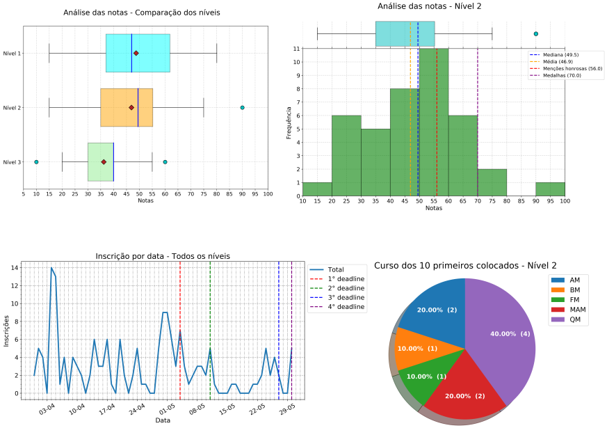

# Análise estatística da OIQ 2019

Projeto de análise estatística da Olimpíada Interna de Química de uma instituição
de ensino.

*O nome da instituição e os dados dos alunos foram anonimizados.*

## Organização

Há duas pastas: inscrições e resultados. Ou seja, há uma análise dos dados de
inscrições (inscrições por data, por curso, por nível etc) e, posteriormente,
dos resultados das provas (alunos faltosos, perfil de notas por nível,
rendimento relativo de cada nível etc).

A linguagem de programação utilizada foi Python, com uso da biblioteca `pandas`.
Diversas funções foram criadas para automatizar as análises. Tais funções se
encontram nos arquivos `input_data.py`, havendo um arquivo para as inscrições e
outro para os resultados. Também foram criadas funções para padronizar os gráficos
da análise. Tais funções se  encontram nos arquivos `plots.py`, havendo um arquivo
 para as inscrições e outro para os resultados. Ambos os arquivos são importados
nos Jupyter Notebooks presentes no repositório.

As pastas denominadas `dados_brutos` dentro de inscrições e de resultados possuem
os arquivos originais que servem de partida para as análises. As únicas alterações
feitas nesses arquivos antes de disponibilizá-los neste repositório foram para
anonimizar os dados (códigos aleatórios no lugar de nomes, retirada de campos de
e-mail e telefone). O código fonte do gerador de cógidos aleatórios está [neste
notebook](gerador_nomes_anonimos.ipynb).

Um [relatório](estatisticas_oiq_2019_github.pdf) foi gerado com a análise das
inscrições e dos resultados. O relatório foi escrito em LaTeX de forma que se fez
muito uso dos métodos de exportação em formato LaTeX do `pandas` conforme visto
nos Notebooks do repositório.

## Objetivo do repositório

Apresentar aos demais membros da comissão como a análise é feita para facilitar
a comunicação interna da comissão e a compreensão. E, também, abrir à comunidade
interna e externa da instituição para que outras pessoas possam sugerir correções e
melhorias tanto de código quanto de interpretação dos dados. É, igualmente, uma
oportunidade de novatos em programação terem mais uma fonte de dados para treinar
o uso de `pandas` e Python em geral, servindo de incentivo aos alunos da instituição
para iniciarem os estudos em programação.

## Histórico

A primeira edição da Olimpíada Interna de Química foi em 2018. Com base no aprendizado
da primeira edição, a comissão resolveu que seria interessante fazer um acompanhamento
estatístico das edições da olimpíada. Assim, fiquei responsável por avaliar os dados
de inscrições e dos resultados da edição de 2018.

Com o conhecimento adquirido em tal processo, resolvi automatizar o que fosse
possível utilizando programação para que as análises dos anos posteriores fossem mais
rápidas. Assim, utilizando a biblioteca `pandas` da linguagem Python, desenvolvi diversas funções que retornam os resultados que a comissão organizadora deseja
avaliar.

Com a edição de 2019, tais funções foram otimizadas e o resultado é esse apresentado
nesse repositório.

## Organização da comissão

A comissão possui um responsável pela elaboração do formulário de inscrições
(um formulário do Google Forms) que, após as inscrições finalizarem, passa a planilha
resultante desse formulário ao responsável pelas estatísticas. Após a correção
das provas pelos professores da comissão, as notas são digitadas em planilhas,
uma para cada nível que, então, são passadas ao responsável pelas estatísticas.
Obviamente, ainda há subdivisões da comissão para divulgação do evento, elaboração
das provas e outras atividades de suporte ao evento.

## Licença

O conteúdo do projeto é licenciado sob [Creative Commons Attribution-NonCommercial-ShareAlike 4.0 International license](https://creativecommons.org/licenses/by-nc-sa/4.0/) e o código usado para
formatar e apresentar o conteúdo é licenciado sob [MIT license](LICENSE).

The content of this project itself is licensed under the [Creative Commons Attribution-NonCommercial-ShareAlike 4.0 International license](https://creativecommons.org/licenses/by-nc-sa/4.0/), and the underlying source code used to format and display that content is licensed under the [MIT license](LICENSE).

## Autor

Francisco Lucio de S. Bustamante